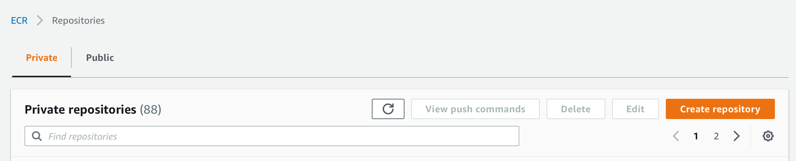

## Co je to vlastně Docker?

Docker je nástroj, který zjednodušuje práci s Linux kontejnery.
Jak už značí tento popis, kontejnery jsou funkcí Linux jádra.

Linux kontejner není žádná magie. [Zde](https://jvns.ca/blog/2020/04/27/new-zine-how-containers-work/) se můžete podívat na jednoduchý návod,
jak si vlastními silami rozjet kontejner bez Dockeru.

> Pozor, Docker umí pracovat i s [Windows kontejnery](https://www.docker.com/products/windows-containers). Ale to je látka na úplně jiný workshop.

## Je Docker ta jediná cesta?

Ne. Obraz, s kterým půjde udělat nějaká paráda, můžete sestavit i jinými nástroji,
které jsou [OCI](https://www.docker.com/blog/demystifying-open-container-initiative-oci-specifications/) kompatibilní.
Můžeme si uvést i pár příkladů:

- https://buildah.io
- https://github.com/GoogleContainerTools/kaniko
- https://github.com/uber/makisu

Jenže Docker toho umí víc, než jen obrazy stavět. Umí je stahovat, posílat do repozitáře,
spouštět a spoustu dalších věcí. I proto je to tak oblíbený nástroj. Umí skoro všechno.
Podobným projektem je pak [Podman](https://podman.io) od RedHat. Ten taky umí skoro všechno.

## Dockerfile používající externě sestavenou app

Tohle je scénář, co můžete občas vidět v automatizaci. Obecně asi nejde říct,
jestli je dobrý nebo špatný. Má svoje místo a jeho obrovskou výhodou jsou
krátké Dockerfile definice.

V případě Go můžu dokonce použít nejmenší možný obraz (to je `scratch`,
ale ten se moc nehodí na vzdělávací účely), protože Go (většinou)
nevyžaduje žádné sdílené knihovny. V tomhle případě má [obraz](https://catalog.redhat.com/software/containers/ubi8/ubi-minimal/5c359a62bed8bd75a2c3fba8?gti-tabs=unauthenticated) 37MiB a my ho trochu přifoukneme naším binárním souborem.

```Dockerfile
FROM registry.access.redhat.com/ubi8/ubi-minimal
COPY app/main ./
CMD ["./main"]
```

1. build aplikace

    ```bash
    cd app
    GOOS=linux GOARCH=amd64 go build main.go
    cd ..

2. příprava Dockerfile pro tento scénář

    ```bash
    cat docker/01.Dockerfile > Dockerfile
    cat Dockerfile
    ```

3. build docker obrazu

    ```bash
    docker buildx build --platform linux/amd64 -f Dockerfile -t mujobraz01:mujtag .
    ````

4. kontrola velikosti

    ```bash
    docker images | grep mujobraz01
    ```

5. Spuštění obrazu (lokálně)

    ```bash
    docker run -it --rm mujobraz01:mujtag
    ```

## Dockerfile sestavující Go app přímo v buildu

Vše předchozí se může stát přimo v Dockerfile. Tohle je postup, kdy
aplikaci sestavíme, necháme jí ve stejném obrazu a ten potom pošleme
do světa. Hodí se to třeba v případech, kdy nechcete řešit build
prostředí a nebo používate automatizační flow, kdy je výhodné udělat
build aplikačních artefaktů při buildu Docker obrazu.

1. příprava Dockerfile pro tento scénář

    ```bash
    cat docker/02.Dockerfile > Dockerfile
    cat Dockerfile
    ```

2. build Docker obrazu

    ```bash
    docker buildx build --platform linux/amd64 -f Dockerfile -t mujobraz02:mujtag .
    ```

3. test běhu

    ```bash
    docker run -it --rm mujobraz02:mujtag
    ```

4. kontrola velikosti obrazu

    ```bash
    docker images | grep mujobraz02
    ```

    > Hmmm, tenhle je trochu větší, proč to tak je? No to proto, že build prostředí
    > pro programovací jazyk něco zabare! Deklarovaná velikost [obrazu](https://catalog.redhat.com/software/containers/ubi8/go-toolset/5ce8713aac3db925c03774d1?gti-tabs=unauthenticated) je přes 300MiB

## Dockerfile sestavující Go app přímo v buildu, Multi-stage varianta

Dockerfile ale může obsahovat více definic. Ve výchozím stavu se ta poslední
považuje jako ten výstupní obraz a zbytek je zahozen. To skvěle funguje právě
v našem případě!

1. příprava Dockerfile pro tento scénář

    ```bash
    cat docker/03.Dockerfile > Dockerfile
    cat Dockerfile
    ```

2. build Docker obrazu

    ```bash
    docker buildx build --platform linux/amd64 -f Dockerfile -t mujobraz03:mujtag .
    ```

3. test běhu

    ```bash
    docker run -it --rm mujobraz03:mujtag
    ```

4. kontrola velikosti obrazu

    ```bash
    docker images | grep mujobraz03
    ```

> A zase se dostávám ne původní velikost cca. 120MiB. V této třetí variantě jsme
> de-facto spojily 2 předchozí.

## Optimalizovaný build

Docker používá něco, čemu se říká cache vrstev. Základní myšlenka je,
že nepotřebujete stavět něco, co váš stroj už udělal. Celý tenhle mechanismus
je možný díky otisku vrstev. Ted je kombinací nakopírovaných souborů, příkazů `RUN`
a dalších věcí (různé nástroje přistupují k otiskům různým způsobem).

Je jasné, že aplikační kód se mění. SW Engineering (většinou) není o pouštění
stejných věcí dokola. Takže u vrstvy s kódem nelze efektivně využívat cache.
Ale co třeba závislosti? Ty se přeci mění vzácně!

A proč bych měl kvůli každé změně kódu stahovat nemalé množství externích
závislostí?

1. příprava Dockerfile pro tento scénář

    ```bash
    cat docker/04.Dockerfile > Dockerfile
    cat Dockerfile
    ```

2. build Docker obrazu

    ```bash
    docker buildx build --platform linux/amd64 -f Dockerfile -t mujobraz04:mujtag .
    ```

3. změna něčeho v kódu

4. další build

    ```bash
    docker buildx build --platform linux/amd64 -f Dockerfile -t mujobraz04:mujtag .
    ```

> Další build Docker obrazu sice sestavuje aplikaci, ale už nestahuje externí
> závislosti. Není k tomu důvod, v souborech `go.mod` a `go.sum` se nic nezměnilo.

## Metoda pojmenování obrazů a jejich vztah k repozitářům

Každý obraz má svůj domov. Proto je značíme nějakým hostname prefixem,
jménem obrau a pak tagem.

Třeba takhle vypadá jeden z obrazů, které jsme používaly v předchozím kroku:

```
registry.access.redhat.com/ubi8/ubi-minimal
```

A proč mi teda funguje nálsedující příkaz, když tam není žádné doménové jméno?

```
docker run -it --rm alpine sh
```

Tady se opět vracíme k tomu, že Docker není jen nástroj na prosté skládání
vrstev filesystému, ale vnáší do hry nějaký "názor". V tomto konkrétním případě
jde o prefix, který dává všem obrazům, které ho nemají: `docker.io/library/`.

Takže obraz apline je ve skutečnoti `docker.io/library/alpine`, ale tvůrci
Dockeru nám usnadnili práci v případě, že používáme obrazy z jejich repozitáře.

## Vlastní repozitář

Vlastní repozitař na obrazy může mít každý. Můžete si někde rozjet vlastní instanci
a nebo můžete sáhnout po nějakém hotovém řešení.

- ECR https://aws.amazon.com/ecr/
- ACR https://azure.microsoft.com/en-us/services/container-registry/
- Quay https://quay.io
- GCR https://cloud.google.com/container-registry

Tenhle workshop je ale o AWS, takže si v konzoli AWS vytvoříme nový 
privátní Elastic Container Registry rpozitář.



## Tagování

Náš poslední, optimalizovaný, obraz jsme sestavili s názvem `mujobraz04:mujtag`. Ale
vzdálený repozitář nese název `123456789123.dkr.ecr.eu-west-1.amazonaws.com/mujobraz04`.

Obrazu můžeme snadno přidat další název příkazem `docker tag`:

```bash
docker tag mujobraz04:mujtag 123456789123.dkr.ecr.eu-west-1.amazonaws.com/mujobraz04:mujtag
```

## Push do vzdáleného registru

U takto otagovaného obrazu už Docker ví, že ho nechceme dostat do výchozího repozitáře `docker.io/library`.
Můžeme tedy zkusit poslat všechny vrstvy do Elastic Container Registry příkazem `docker push`.

```bash
docker push 123456789123.dkr.ecr.eu-west-1.amazonaws.com/mujobraz04:mujtag
```

Jenomže ono to nejde. 

```
The push refers to repository [123456789123.dkr.ecr.eu-west-1.amazonaws.com/mujobraz04]
e97c82fec71e: Preparing 
04a05557bbad: Preparing 
821b0c400fe6: Preparing 
no basic auth credentials
```

Proč? Většinou chceme, aby do registru měl přístup jen omezený počet jedinců. Proto se musíme
AWS Elastic Container Registry nějak prokázat.

## Získání credentials do ECR

Docker si přihlášení do registrů ukládá v souboru `~/.docker/config.json`. Cílový stav pro náš
repozitář vypadá nějak takhle:

```json
{
  "experimental" : "disabled",
  "auths" : {
    "123456789123.dkr.ecr.eu-west-1.amazonaws.com" : {
        "auth": "nějaký token"
    }
  }
}
```

Jak získáme token? AWS na to má příkaz, který nám takový token poskytne.

```bash
aws ecr get-login-password --region=eu-west-1
```

A pokud nechceme editovat `~/.docker/config.json` soubor ručně, 
tak si můžeme pomoci příkazem `docker login`, který se o všechno postará:

```bash
docker login -u AWS -p $(aws ecr get-login-password --region=eu-west-1) 123456789123.dkr.ecr.eu-west-1.amazonaws.com
```

> Něco navíc: Token do ECR má omezenou platnost. Pro někoho může být otravné se
> třeba každý den přihlašovat znovu. Tento stav lze obejít použitím credentials helperů,
> konkrétně pro AWS ECR se používá [tento](https://github.com/awslabs/amazon-ecr-credential-helper).
> Takový helper si ve vašem prostředí vezme AWS credentials a získá pro vás taken automaticky.


