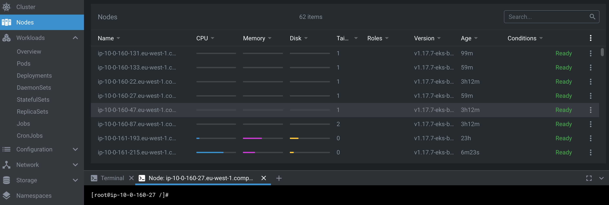

# 칔vod do kontejner콢 a jejich cesty do Kubernetes - AWS edice

## Co je to vlastn캩 Docker?

Docker je n치stroj, kter칳 zjednodu코uje pr치ci s Linux kontejnery.
Jak u zna캜칤 tento popis, kontejnery jsou funkc칤 Linux j치dra.

Linux kontejner nen칤 쮂멳n치 magie. [Zde](https://jvns.ca/blog/2020/04/27/new-zine-how-containers-work/) se m콢쬰te pod칤vat na jednoduch칳 n치vod,
jak si vlastn칤mi silami rozjet kontejner bez Dockeru.

> Pozor, Docker um칤 pracovat i s [Windows kontejnery](https://www.docker.com/products/windows-containers). Ale to je l치tka na 칰pln캩 jin칳 workshop.

## Je Docker ta jedin치 cesta?

Ne. Obraz, s kter칳m p콢jde ud캩lat n캩jak치 par치da, m콢쬰te sestavit i jin칳mi n치stroji,
kter칠 jsou [OCI](https://www.docker.com/blog/demystifying-open-container-initiative-oci-specifications/) kompatibiln칤.
M콢쬰me si uv칠st i p치r p콏칤klad콢:

- https://buildah.io
- https://github.com/GoogleContainerTools/kaniko
- https://github.com/uber/makisu

Jen쬰 Docker toho um칤 v칤c, ne jen obrazy stav캩t. Um칤 je stahovat, pos칤lat do repozit치콏e,
spou코t캩t a spoustu dal코칤ch v캩c칤. I proto je to tak obl칤ben칳 n치stroj. Um칤 skoro v코echno.
Podobn칳m projektem je pak [Podman](https://podman.io) od RedHat. Ten taky um칤 skoro v코echno.

## Dockerfile pou쮂셨aj칤c칤 extern캩 sestavenou app

Tohle je sc칠n치콏, co m콢쬰te ob캜as vid캩t v automatizaci. Obecn캩 asi nejde 콏칤ct,
jestli je dobr칳 nebo 코patn칳. M치 svoje m칤sto a jeho obrovskou v칳hodou jsou
kr치tk칠 Dockerfile definice.

V p콏칤pad캩 Go m콢쬿 dokonce pou쮂셦 nejmen코칤 mo쬹칳 obraz (to je `scratch`,
ale ten se moc nehod칤 na vzd캩l치vac칤 칰캜ely), proto쬰 Go (v캩t코inou)
nevy쬬duje 쮂멳n칠 sd칤len칠 knihovny. V tomhle p콏칤pad캩 m치 [obraz](https://catalog.redhat.com/software/containers/ubi8/ubi-minimal/5c359a62bed8bd75a2c3fba8?gti-tabs=unauthenticated) 37MiB a my ho trochu p콏ifoukneme na코칤m bin치rn칤m souborem.

```Dockerfile
FROM registry.access.redhat.com/ubi8/ubi-minimal
COPY app/main ./
CMD ["./main"]
```

1. build aplikace

    ```bash
    cd app
    GOOS=linux GOARCH=amd64 go build main.go
    cd ..

2. p콏칤prava Dockerfile pro tento sc칠n치콏

    ```bash
    cat docker/01.Dockerfile > Dockerfile
    cat Dockerfile
    ```

3. build docker obrazu

    ```bash
    docker buildx build --platform linux/amd64 -f Dockerfile -t mujobraz01:mujtag .
    ````

4. kontrola velikosti

    ```bash
    docker images | grep mujobraz01
    ```

5. Spu코t캩n칤 obrazu (lok치ln캩)

    ```bash
    docker run -it --rm mujobraz01:mujtag
    ```

## Dockerfile sestavuj칤c칤 Go app p콏칤mo v buildu

V코e p콏edchoz칤 se m콢쬰 st치t p콏imo v Dockerfile. Tohle je postup, kdy
aplikaci sestav칤me, nech치me j칤 ve stejn칠m obrazu a ten potom po코leme
do sv캩ta. Hod칤 se to t콏eba v p콏칤padech, kdy nechcete 콏e코it build
prost콏ed칤 a nebo pou쮂셨ate automatiza캜n칤 flow, kdy je v칳hodn칠 ud캩lat
build aplika캜n칤ch artefakt콢 p콏i buildu Docker obrazu.

1. p콏칤prava Dockerfile pro tento sc칠n치콏

    ```bash
    cat docker/02.Dockerfile > Dockerfile
    cat Dockerfile
    ```

2. build Docker obrazu

    ```bash
    docker buildx build --platform linux/amd64 -f Dockerfile -t mujobraz02:mujtag .
    ```

3. test b캩hu

    ```bash
    docker run -it --rm mujobraz02:mujtag
    ```

4. kontrola velikosti obrazu

    ```bash
    docker images | grep mujobraz02
    ```

    > Hmmm, tenhle je trochu v캩t코칤, pro캜 to tak je? No to proto, 쬰 build prost콏ed칤
    > pro programovac칤 jazyk n캩co zabare! Deklarovan치 velikost [obrazu](https://catalog.redhat.com/software/containers/ubi8/go-toolset/5ce8713aac3db925c03774d1?gti-tabs=unauthenticated) je p콏es 300MiB

## Dockerfile sestavuj칤c칤 Go app p콏칤mo v buildu, Multi-stage varianta

Dockerfile ale m콢쬰 obsahovat v칤ce definic. Ve v칳choz칤m stavu se ta posledn칤
pova쬿je jako ten v칳stupn칤 obraz a zbytek je zahozen. To skv캩le funguje pr치v캩
v na코em p콏칤pad캩!

1. p콏칤prava Dockerfile pro tento sc칠n치콏

    ```bash
    cat docker/03.Dockerfile > Dockerfile
    cat Dockerfile
    ```

2. build Docker obrazu

    ```bash
    docker buildx build --platform linux/amd64 -f Dockerfile -t mujobraz03:mujtag .
    ```

3. test b캩hu

    ```bash
    docker run -it --rm mujobraz03:mujtag
    ```

4. kontrola velikosti obrazu

    ```bash
    docker images | grep mujobraz03
    ```

> A zase se dost치v치m ne p콢vodn칤 velikost cca. 120MiB. V t칠to t콏et칤 variant캩 jsme
> de-facto spojily 2 p콏edchoz칤.

## Optimalizovan칳 build

Docker pou쮂셨치 n캩co, 캜emu se 콏칤k치 cache vrstev. Z치kladn칤 my코lenka je,
쬰 nepot콏ebujete stav캩t n캩co, co v치코 stroj u ud캩lal. Cel칳 tenhle mechanismus
je mo쬹칳 d칤ky otisku vrstev. Ted je kombinac칤 nakop칤rovan칳ch soubor콢, p콏칤kaz콢 `RUN`
a dal코칤ch v캩c칤 (r콢zn칠 n치stroje p콏istupuj칤 k otisk콢m r콢zn칳m zp콢sobem).

Je jasn칠, 쬰 aplika캜n칤 k칩d se m캩n칤. SW Engineering (v캩t코inou) nen칤 o pou코t캩n칤
stejn칳ch v캩c칤 dokola. Tak쬰 u vrstvy s k칩dem nelze efektivn캩 vyu쮂셨at cache.
Ale co t콏eba z치vislosti? Ty se p콏eci m캩n칤 vz치cn캩!

A pro캜 bych m캩l kv콢li ka쬯칠 zm캩n캩 k칩du stahovat nemal칠 mno쬽tv칤 extern칤ch
z치vislost칤?

1. p콏칤prava Dockerfile pro tento sc칠n치콏

    ```bash
    cat docker/04.Dockerfile > Dockerfile
    cat Dockerfile
    ```

2. build Docker obrazu

    ```bash
    docker buildx build --platform linux/amd64 -f Dockerfile -t mujobraz04:mujtag .
    ```

3. zm캩na n캩캜eho v k칩du

4. dal코칤 build

    ```bash
    docker buildx build --platform linux/amd64 -f Dockerfile -t mujobraz04:mujtag .
    ```

> Dal코칤 build Docker obrazu sice sestavuje aplikaci, ale u nestahuje extern칤
> z치vislosti. Nen칤 k tomu d콢vod, v souborech `go.mod` a `go.sum` se nic nezm캩nilo.

## Metoda pojmenov치n칤 obraz콢 a jejich vztah k repozit치콏콢m

Ka쬯칳 obraz m치 sv콢j domov. Proto je zna캜칤me n캩jak칳m hostname prefixem,
jm칠nem obrau a pak tagem.

T콏eba takhle vypad치 jeden z obraz콢, kter칠 jsme pou쮂셨aly v p콏edchoz칤m kroku:

```
registry.access.redhat.com/ubi8/ubi-minimal
```

A pro캜 mi teda funguje n치lseduj칤c칤 p콏칤kaz, kdy tam nen칤 쮂멳n칠 dom칠nov칠 jm칠no?

```
docker run -it --rm alpine sh
```

Tady se op캩t vrac칤me k tomu, 쬰 Docker nen칤 jen n치stroj na prost칠 skl치d치n칤
vrstev filesyst칠mu, ale vn치코칤 do hry n캩jak칳 "n치zor". V tomto konkr칠tn칤m p콏칤pad캩
jde o prefix, kter칳 d치v치 v코em obraz콢m, kter칠 ho nemaj칤: `docker.io/library/`.

Tak쬰 obraz apline je ve skute캜noti `docker.io/library/alpine`, ale tv콢rci
Dockeru n치m usnadnili pr치ci v p콏칤pad캩, 쬰 pou쮂셨치me obrazy z jejich repozit치콏e.

## Vlastn칤 repozit치콏

Vlastn칤 repozita콏 na obrazy m콢쬰 m칤t ka쬯칳. M콢쬰te si n캩kde rozjet vlastn칤 instanci
a nebo m콢쬰te s치hnout po n캩jak칠m hotov칠m 콏e코en칤.

- ECR https://aws.amazon.com/ecr/
- ACR https://azure.microsoft.com/en-us/services/container-registry/
- Quay https://quay.io
- GCR https://cloud.google.com/container-registry

Tenhle workshop je ale o AWS, tak쬰 si v konzoli AWS vytvo콏칤me nov칳 
priv치tn칤 Elastic Container Registry rpozit치콏.


## Tagov치n칤

N치코 posledn칤, optimalizovan칳, obraz jsme sestavili s n치zvem `mujobraz04:mujtag`. Ale
vzd치len칳 repozit치콏 nese n치zev `123456789123.dkr.ecr.eu-west-1.amazonaws.com/mujobraz04`.

Obrazu m콢쬰me snadno p콏idat dal코칤 n치zev p콏칤kazem `docker tag`:

```bash
docker tag mujobraz04:mujtag 123456789123.dkr.ecr.eu-west-1.amazonaws.com/mujobraz04:mujtag
```

## Push do vzd치len칠ho registru

U takto otagovan칠ho obrazu u Docker v칤, 쬰 ho nechceme dostat do v칳choz칤ho repozit치콏e `docker.io/library`.
M콢쬰me tedy zkusit poslat v코echny vrstvy do Elastic Container Registry p콏칤kazem `docker push`.

```bash
docker push 123456789123.dkr.ecr.eu-west-1.amazonaws.com/mujobraz04:mujtag
```

Jenom쬰 ono to nejde. 

```
The push refers to repository [123456789123.dkr.ecr.eu-west-1.amazonaws.com/mujobraz04]
e97c82fec71e: Preparing 
04a05557bbad: Preparing 
821b0c400fe6: Preparing 
no basic auth credentials
```

Pro캜? V캩t코inou chceme, aby do registru m캩l p콏칤stup jen omezen칳 po캜et jedinc콢. Proto se mus칤me
AWS Elastic Container Registry n캩jak prok치zat.

## Z칤sk치n칤 credentials do ECR

Docker si p콏ihl치코en칤 do registr콢 ukl치d치 v souboru `~/.docker/config.json`. C칤lov칳 stav pro n치코
repozit치콏 vypad치 n캩jak takhle:

```json
{
  "experimental" : "disabled",
  "auths" : {
    "123456789123.dkr.ecr.eu-west-1.amazonaws.com" : {
        "auth": "n캩jak칳 token"
    }
  }
}
```

Jak z칤sk치me token? AWS na to m치 p콏칤kaz, kter칳 n치m takov칳 token poskytne.

```bash
aws ecr get-login-password --region=eu-west-1
```

A pokud nechceme editovat `~/.docker/config.json` soubor ru캜n캩, 
tak si m콢쬰me pomoci p콏칤kazem `docker login`, kter칳 se o v코echno postar치:

```bash
docker login -u AWS -p $(aws ecr get-login-password --region=eu-west-1) 123456789123.dkr.ecr.eu-west-1.amazonaws.com
```

> N캩co nav칤c: Token do ECR m치 omezenou platnost. Pro n캩koho m콢쬰 b칳t otravn칠 se
> t콏eba ka쬯칳 den p콏ihla코ovat znovu. Tento stav lze obej칤t pou쬴t칤m credentials helper콢,
> konkr칠tn캩 pro AWS ECR se pou쮂셨치 [tento](https://github.com/awslabs/amazon-ecr-credential-helper).
> Takov칳 helper si ve va코em prost콏ed칤 vezme AWS credentials a z칤sk치 pro v치s taken automaticky.

## Push do vzd치len칠ho registru je코t캩 jednou

Tak쬰 te캞 Docker v칤, jak se m치 p콏ihl치sit a my m콢쬰me zkusit zopakovat p콏칤kaz `docker push`.

```bash
docker push 123456789123.dkr.ecr.eu-west-1.amazonaws.com/mujobraz04:mujtag
```

Je to tam 游꿀 

## P콏ihl치코en칤 do EKS

Kubernetes jako takov칠 nen칤 p콏edm캩tem tohoto workshopu. Proto si jen zjednodu코en캩 vysv캩tl칤me,
jak je AWS p콏ipraven칠 na p콏ihla코ov치n칤 u쬴vatel콢 do jejich managed Kubernetes slu쬭y.

Stejn캩, jako v p콏칤pad캩 ECR, i tady m치me n캩jak칳 helper, kter칳 n치m vygeneruje credentials
pro danou slu쬭u.

```bash
aws eks update-kubeconfig --name cluster-eu-west-1
```

To je v코echno. Tenhle helper zap칤코e do `~/.kube/config` a pak ka쬯칳 Kubernetes klient
(`kubectl`, `Go SDK`, `LENS`, ...) v칤, jak se m치 do dan칠ho clusteru p콏ipojit.

Funk캜nost si m콢쬰me ov캩콏it t콏eba takto:

```
kubectl get nodes
NAME                                         STATUS   ROLES    AGE     VERSION
ip-10-0-160-131.eu-west-1.compute.internal   Ready    <none>   94m     v1.17.7-eks-bffbac
ip-10-0-160-133.eu-west-1.compute.internal   Ready    <none>   54m     v1.17.7-eks-bffbac
ip-10-0-160-22.eu-west-1.compute.internal    Ready    <none>   3h7m    v1.17.7-eks-bffbac
ip-10-0-160-27.eu-west-1.compute.internal    Ready    <none>   54m     v1.17.7-eks-bffbac
ip-10-0-160-47.eu-west-1.compute.internal    Ready    <none>   3h7m    v1.17.7-eks-bffbac
ip-10-0-160-87.eu-west-1.compute.internal    Ready    <none>   3h7m    v1.17.7-eks-bffbac
ip-10-0-161-193.eu-west-1.compute.internal   Ready    <none>   23h     v1.17.7-eks-bffbac
ip-10-0-161-215.eu-west-1.compute.internal   Ready    <none>   119s    v1.17.7-eks-bffbac
```

## P콏ihl치코en칤 do EKS trochu jinak

Kubernetes nen칤 zrovna jednoduch칳 n치stroj. Pro zjednodu코en칤 se do jeho 칰trob m콢쬰me pod칤vat t콏eba
n치strojem [LENS](https://k8slens.dev), kter칳 n치m m콢쬰 pomoci zn치zornit celou tu sm캩s r콢zn칳ch
APIs.



## Vytvo콏en칤 prvn칤ho podu

Pod je v Kubernetes z치kladn칤m v칳po캜etn칤m prvkem. V코echny slo쬴t캩j코칤 (compute) objekty jsou slo쬰ny pr치v캩
z Pod콢. Jeho API m치 vcelku jednoduchou syntaxi, a tak si jeden vytvo콏칤me.

```yaml
apiVersion: v1
kind: Pod
metadata:
  name: hello
  labels:
    app: hello
spec:
  containers:
    - name: hello
      image: 123456789123.dkr.ecr.eu-west-1.amazonaws.com/mujobraz04:mujtag
      ports:
        - name: http
          containerPort: 8080
          protocol: TCP
```

Takto vytvo콏enou specifikaci podu m콢쬰me snadno prom캩nit v n캩co skute캜n칠ho jednoduch칳m
aplikov치n칤m zm캩n:

```bash
kubectl apply -f kubernetes/pod.yaml
```

## Zobrazen칤 stavu podu

Kdy chceme zjistit, jestli je pod na m칤st캩 a jestli 쬴je, sta캜칤 n치m zavolat `kubectl get pod`.

```
kubectl get pod
NAME    READY   STATUS              RESTARTS   AGE
hello   0/1     ContainerCreating   0          18s
```

```
kubectl get pod
NAME    READY   STATUS    RESTARTS   AGE
hello   1/1     Running   0          37s
```

## Jak se tam dostal ten obraz?

Kdy se vr치t칤me k epizod캩, kde se n치m nepoda콏ilo komunikovat s ECR, jak칳m zp콢sobem se poda콏ilo
rozjet Pod s t칤mto obrazem v Kubernetes clusteru? Jak se tam ten virtu치ln칤 stroj dostal?

